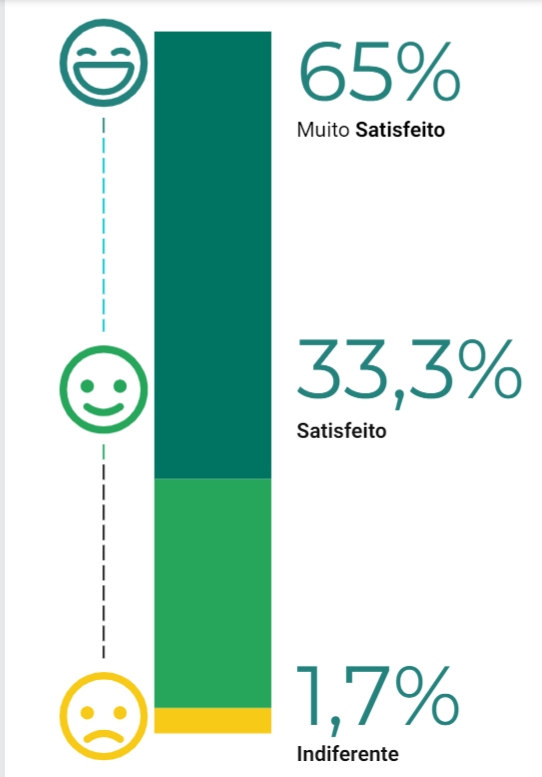
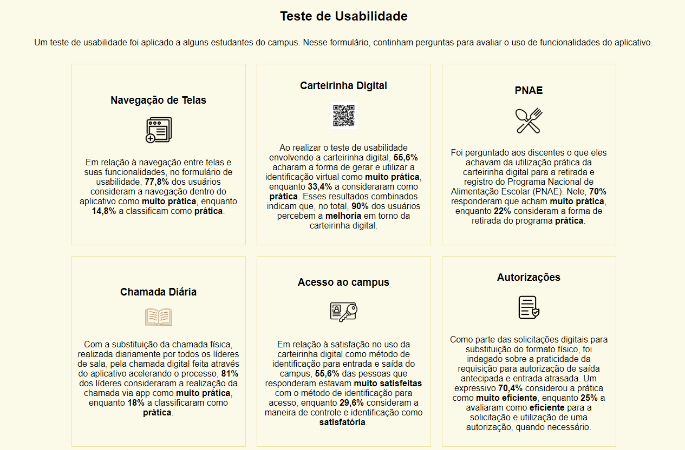

# MeuIF 
**[Download do Aplicativo Android](MeuIF.apk)**

**[WebSite Multiplataforma](https://meuif-15823.web.app/)**

**[Artigo Do Projeto](Artigo-MeuIF.pdf)**

## MeuIF: um aplicativo para o gerenciamento de atividades acadêmicas, frequência escolar e otimização dos procedimentos da seção pedagógica do IFPR Campus Cascavel
**MeuIF: managing application for academic activities, school attendance and optimizing procedures in the pedagogical section of the IFPR Campus Cascavel**

  

---

**Autores:**
- Gabriel Costa de Moraes
- Heloísa Raquel Siebeneichler
- Fernando Alves de Lima
- Odair Moreira de Souza

---

## Resumo

No âmbito do Instituto Federal do Paraná, Campus Cascavel, surgiu a necessidade de desenvolver um software capaz de otimizar tarefas diárias dos alunos e da Seção Pedagógica e de Assuntos Educacionais (SEPAE). Nesse contexto, este trabalho realizou o desenvolvimento do aplicativo MeuIF, voltado para dispositivos Android, que auxilia a SEPAE na identificação da evasão escolar, otimização dos procedimentos da seção pedagógica e gerenciamento de atividades acadêmicas do IFPR Campus Cascavel.

## Desenvolvimento

O desenvolvimento do aplicativo MeuIF foi implementado no ambiente do Android Studio, empregando a linguagem de programação Java e utilizando a infraestrutura de computação em nuvem Google Cloud Platform.

## Conclusão

Em conclusão, o desenvolvimento do aplicativo MeuIF representa um avanço significativo na otimização e simplificação das atividades diárias dos alunos e da SEPAE, atendendo à necessidade premente de aprimoramento das operações.

Com base nos resultados do teste de usabilidade, observamos uma receptividade positiva dos estudantes, líderes de sala e a SEPAE em relação às funcionalidades do aplicativo, evidenciando sua praticidade e eficácia no contexto da instituição. 

  

  

---

© 2023 Gabriel C. Moraes & Heloísa Raquel.
